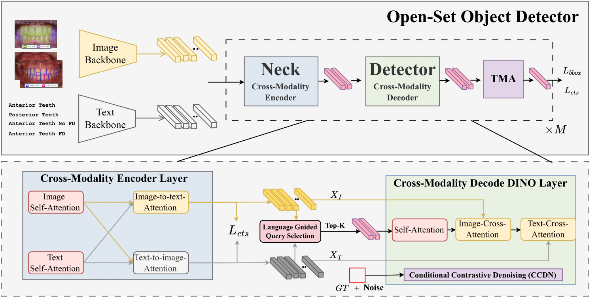
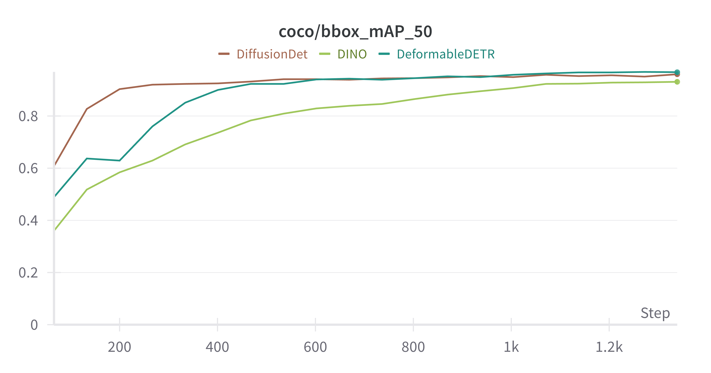

# FD-SOS: Vision-Language Open-Set Detectors for Bone Fenestration and Dehiscence Detection from Intraoral Images

###### [Marawan Elbatel](https://marwankefah.github.io/), Keyuan Liu, Yanqi Yang, [Xiaomeng Li](https://xmengli.github.io/)

This is the official implementation of the framework FD-SOS, for **FD** **S**creening utilizing **O**pen-**S**et detectors  in intraoral images.

## Abstract
Accurate detection of bone fenestration and dehiscence (FD) is crucial for effective treatment planning in dentistry. While cone-beam computed tomography (CBCT) is the gold standard for evaluating FD, it comes with limitations such as radiation exposure, limited accessibility, and higher cost compared to intraoral images. In intraoral images, dentists face challenges in the differential diagnosis of FD. This paper presents a novel and clinically significant application of FD detection solely from intraoral images. To achieve this, we propose FD-SOS, a novel open-set object detector for FD detection from intraoral images. FD-SOS has two novel components: conditional contrastive denoising (CCDN) and teeth-specific matching assignment (TMA). These modules enable FD-SOS to effectively leverage external dental semantics. Experimental results showed that our method outperformed existing detection methods and surpassed dental professionals by 35% recall under the same level of precision.





## Getting Started

### Installation
1. Clone the repository:
    ```sh
    git clone https://github.com/xmed-lab/FD-SOS
    cd FD-SOS
    ```

2. Create a virtual environment:
    ```sh
    conda create -n SOS python=3.8
    conda activate SOS
    ```

3. Install [PyTorch](https://pytorch.org/get-started/locally/):
    ```sh
    pip3 install torch==2.1.2+cu118 torchvision==0.16.2+cu118 torchaudio==2.1.2+cu118 --index-url https://download.pytorch.org/whl/cu118
    ```

4. Follow [mmdet](https://mmdetection.readthedocs.io/en/latest/get_started.html) to install dependencies :
    ```sh
   bash requirements.sh
    ```

### Download Data, Models, and Configs

5. Download the images:
    ```sh
    #download images
    gdown https://drive.google.com/uc?id=1Xm794_tzCh1TtIfJYJLFlmv013GTL_Uh
    unzip images_all.zip -d data/v1/
   ```
6. Download the model weights, and configs
   ```sh
    #download model weights
    gdown --folder https://drive.google.com/drive/folders/1zgNxQEXhGm3FTIQAKqkYd3YH0O5SHhm_
    ```


## Generating Predictions and Evaluation

To generate predictions using the trained model/weights, make sure to download the images, model weights, and configs:


1. Run inference:
    ```sh
    python inference.py
    ```

2. The model will infer into the evaluation folder. To evaluate COCO Metrics on the generated predictions:
    ```sh
    python evaluate.py
    ```

### Results and Models


We provide detailed results and model weights for reproducibility and further research.

| Methods                       | Multi-task | AP75FD    | APFD      | AP50FD    | AP75      | AP        | AP50      | Model Weights |
|-------------------------------|------------|-----------|-----------|-----------|-----------|-----------|-----------|--------------|
| **Traditional Detectors***    |            |           |           |           |           |           |           |              |
| Diffusion-DETR w/o pretraining | ✗          | 0.04      | 1.31      | 7.58      | 0.04      | 1.7       | 8.85      | [Download](https://drive.google.com/drive/folders/1l9EsF5x8QTV3x0QT6yKeBpAAkR8fIiqH?usp=drive_link) |
| Diffusion-DETR                | ✗          | 55.52     | 51.42     | 61.28     | 62.58     | 59.06     | 66.37     | [Download](https://drive.google.com/drive/folders/1wtbbvAHTwpmRHfyMjc2xuYbBAqvHrY7L?usp=drive_link) |
| DDETR                         | ✗          | 56.92     | 50.41     | 60.51     | 62.68     | 57.44     | 65.48     | [Download](https://drive.google.com/drive/folders/1lWdPoUGe5HQvq5eU4SPCPnXLCf47pqwD?usp=drive_link) |
| DINO                          | ✗          | 54.03     | 49.68     | 57.94     | 55.13     | 51.65     | 57.65     | [Download](https://drive.google.com/drive/folders/1yuxNT8OQefXn7fmcY6P7yvWgNY5pPRz3?usp=drive_link) |
| **Open-Set Detectors †**      |            |           |           |           |           |           |           |              |
| GLIP                          | ✗          | 40.57     | 32.0      | 46.34     | 51.3      | 40.47     | 55.85     | [Download](https://drive.google.com/drive/folders/1sqnFCCi9mWEBcGhUw1flZUwCz8Y70efO?usp=drive_link) |
| GDINO                         | ✗          | 58.32     | 56.59     | 61.07     | 63.69     | 62.59     | 65.89     | [Download](https://drive.google.com/drive/folders/1dnZ010Yo-Xix1Pd56beTPaIfopSpUfVb?usp=drive_link) |
| GLIP                          | ✔️         | 41.78     | 33.68     | 47.09     | 51.97     | 42.73     | 56.7      | [Download](https://drive.google.com/drive/folders/1cZWXUyxbvhJhiikW8srecyOyhMYAmEOA?usp=sharing) |
| GDINO (our baseline)          | ✔️         | 55.55     | 54.75     | 59.99     | 62.6      | 62.08     | 65.81     | [Download](https://drive.google.com/drive/folders/1wiwm1j90HTiriB5UX4gwFRN4_In679FL?usp=sharing) |
| **FD-SOS (ours)**             | ✔️         | **62.45** | **60.84** | **66.01** | **67.07** | **65.97** | **69.67** | [Download](https://drive.google.com/drive/folders/1tY1yDnCE3AA7crXGiHNBN5fGb-zi4XVN?usp=drive_link) |

#### *requires pre-training on public dental dataset after initialization from ImageNet pre-trained weights.
#### † refers to fine-tuning existing VLM pre-trained models.

Traditional object detectors fail without warmup on public dental datasets. We provide warmup models for traditional object detectors available [here]().

<div style="text-align: center;">
    
</div>

## Training FD-SOS

To train FD-SOS , please follow the instructions to [get started](#getting-started
) and install dependencies.


All configs for all experiments are available in [train_FD.sh](train_FD.sh).

To run FD-SOS benchmark, make sure all images are available in [data/v1/images_all](data/v1/images_all) and run:
```
bash train.sh
```

### Acknowledgment
Code is built on [mmdet](https://mmdetection.readthedocs.io/en/latest/get_started.html).

### Citation
````
@article{elbatel2024fd,
  title={FD-SOS: Vision-Language Open-Set Detectors for Bone Fenestration and Dehiscence Detection from Intraoral Images},
  author={Elbatel, Marawan and Liu, Keyuan and Yang, Yanqi and Li, Xiaomeng},
  journal={arXiv preprint arXiv:2407.09088},
  year={2024}
}
````